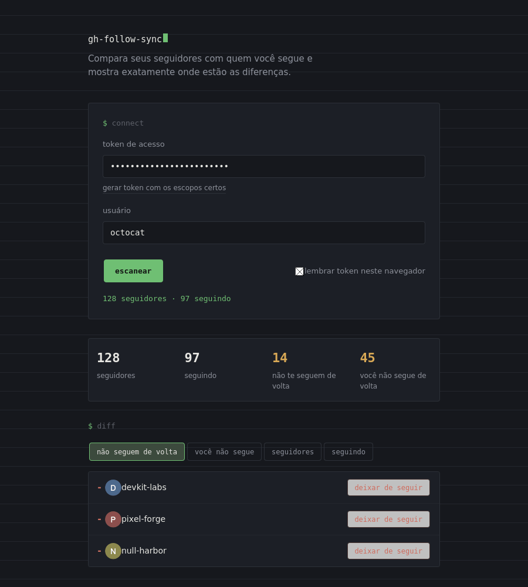

# gh-follow-sync

Ferramenta simples, 100% front-end, para comparar quem te segue no GitHub com quem você segue, e resolver a diferença direto pela API, sem instalar nada.


## Demo



## Como funciona

A página consulta a API REST do GitHub (`/users/:login/followers` e `/users/:login/following`) usando um token pessoal que você mesmo informa, e calcula a diferença entre as duas listas:

- **não seguem de volta**: pessoas que você segue, mas que não te seguem.
- **você não segue de volta**: pessoas que te seguem, mas que você ainda não segue.

Cada linha da lista vem marcada como num `git diff`: `-` para quem pode ser removido, `+` para quem pode ser seguido. Um clique chama `PUT`/`DELETE` em `/user/following/:login` e atualiza a lista na hora.

Não existe backend. Nenhum dado passa por um servidor intermediário, o navegador conversa direto com `api.github.com`.

## Rodando

Não tem build, nem dependências. Duas opções:

**GitHub Pages (recomendado)**
1. Suba este repositório no GitHub.
2. Vá em *Settings → Pages* e aponte para a branch `main`, pasta raiz.
3. Acesse `https://seu-usuario.github.io/nome-do-repo/`.

**Localmente**
```bash
git clone https://github.com/seu-usuario/gh-follow-sync.git
cd gh-follow-sync
python3 -m http.server 8080
# abra http://localhost:8080
```
(Abrir o `index.html` direto com duplo clique, via `file://`, faz o navegador bloquear as chamadas à API. Use um servidor local ou o GitHub Pages.)

## Gerando o token

O token precisa de dois escopos, nada além disso:

- `read:user`: para ler suas listas de seguidores/seguindo.
- `user:follow`: para seguir/deixar de seguir.

Link direto para criar um já com os escopos certos:
`https://github.com/settings/tokens/new?scopes=user:follow,read:user`

Recomendações:
- Use um **fine-grained token** com **expiração curta** (7 a 30 dias).
- Revogue o token depois de usar, se for pontual.
- A opção "lembrar token neste navegador" salva o token no `localStorage` do seu navegador. Não use em computador compartilhado.

## Estrutura

```
gh-follow-sync/
├── index.html          # estrutura da página
├── css/
│   └── style.css       # estilos
├── js/
│   └── script.js       # lógica: chamadas à API, cálculo do diff, render
├── assets/             # screenshot e gif deste README
└── README.md
```

## Limitações conhecidas

- A API do GitHub limita requisições autenticadas a 5.000 por hora, suficiente para uso pessoal normal.
- Contas com dezenas de milhares de seguidores podem demorar alguns segundos a mais para carregar (a lista é paginada em blocos de 100).

## Licença

MIT.
